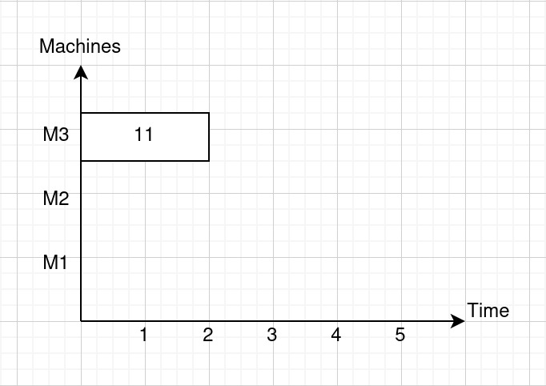
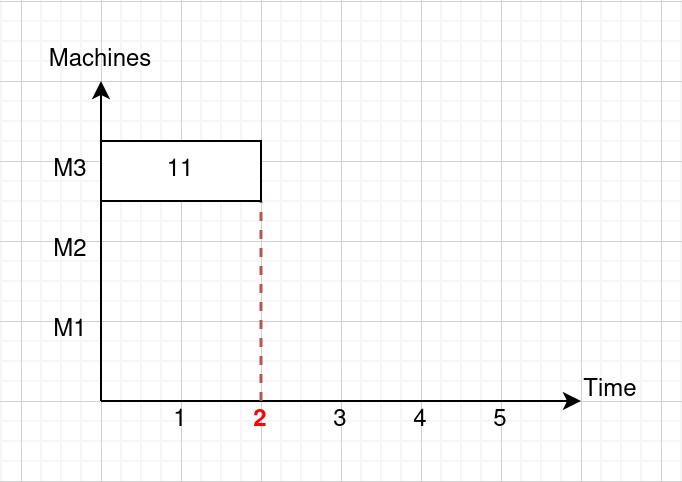

Operation end time lowerbound is used for:

* Node features
* Reward calculation

## How to calculate operation end time lowerbound?
Assuming that we following FJSP problem.

Note: 0 means alternative is not available.

**Job 1**

| Operation / Alternatives | Machine 1 | Machine 2 | Machine 3 |
|--|----|----|----|
| Operation 1 | 1 | 3 | 2 |
| Operation 2 | 0 | 2 | 1 |
| Operation 3 | 0 | 0 | 3 |


**Job 2**

| Operation / Alternatives | Machine 1 | Machine 2 | Machine 3 |
|--|----|----|----|
| Operation 1 | 0 | 0 | 2 |
| Operation 2 | 2 | 2 | 1 |

**Job 3**

| Operation / Alternatives | Machine 1 | Machine 2 | Machine 3 |
|--|----|----|----|
| Operation 1 | 2 | 1 | 0 |
| Operation 2 | 1 | 0 | 1 |
| Operation 3 | 3 | 0 | 0 |

Given we have following partial schedule.



**Figure 1: Current partial schedule**

We have dispatched Operation 1 of Job 1 on Machine 3.

Our `job_makespans` 3D array should be as follows:

```
2 2 2    0 0 2    2 1 0    
0 2 1    2 2 1    1 0 1    
0 0 3    0 0 0    3 0 0
```


<details>
<summary>What is a `job_makespans` array?</summary>

`job_makespans` array is a temporary array used for easy calculation of operation lower bounds.

It is a 3-dimensional array, where each dimension represents the following:

- Matrix: Job
- Row: Operation
- Column: Machine alternative

Each element in the array stores different information depending on the operation's status.

- For the last dispatched operation on a job, it store its processing finish time.
- For operations that are not the last dispatched on a job, it stores a 0 as a placeholder.
- For undispatched operations, it store its duration.

Example 1 (Dispatched operation): Given the above partial schedule (Figure 1), we have the first row of first array storing the processing finish time of Operation 1 of Job 1, which is 2.

<pre><code><span style="color: red; font-weight: 700;">2 2 2</span>    0 0 2    2 1 0    
0 2 1    2 2 1    1 0 1    
0 0 3    0 0 0    3 0 0</code></pre>




Example 2 (Undispatched operation): Because all operations other than Operation 1 of Job 1 are undispatched, hence the elements in `job_makespan` will only store their duration on the machine alternatives.

<pre><code style="color: red; font-weight: 700;"><span style="color: black; font-weight: 400;">2 2 2</span>    0 0 2    2 1 0    
0 2 1    2 2 1    1 0 1    
0 0 3    0 0 0    3 0 0</code></pre>

For instance: The element with index of (0, 1, 1), stores a 2, because Job 1, Operation 2 on Machine 2 has a duration of 2.

<pre><code>2 2 2    0 0 2    2 1 0    
0 <span style="color:red; font-weight: 700;">2</span> 1    2 2 1    1 0 1    
0 0 3    0 0 0    3 0 0</code></pre>

On the other hand, the element with index of (0, 1, 0) stores a 0, because Machine 1 is not able to process Operation 2 of Job 1.

<pre><code>2 2 2    0 0 2    2 1 0    
<span style="color:red; font-weight: 700;">0</span> 2 1    2 2 1    1 0 1    
0 0 3    0 0 0    3 0 0</code></pre>
</details>

Our `operation_end_times` 3D array should be as follows:

```
2 2 2    0 0 0    0 0 0    
0 0 0    0 0 0    0 0 0    
0 0 0    0 0 0    0 0 0
```

<details>
<summary>What is a `operation_end_times` array?</summary>

`operation_end_times` array simply store the processing finish time for dispatched operations.

It is 3D to allow for easy operations with `job_makespans` array.

For undispatched operations, 0 is used as a placeholder.

Example: Because we have only one dispatched Operation 1 of Job 1 with finish time of 2, hence the first row of first matrix has all values of 2. Whereas other operations are undispatched, hence all other elements are 0.
</details>


### How to update operation lower bounds
To calculate the new operation lower bounds once we have dispatched an operation, we only need these 2 arrays:

* `job_makespans`
* `operation_end_times`

With the schedule in Figure 1, both of the arrays should have following values:

`job_makespans`

```
2 2 2    0 0 2    2 1 0    
0 2 1    2 2 1    1 0 1    
0 0 3    0 0 0    3 0 0
```

<br>

`operation_end_times`

```
2 2 2    0 0 0    0 0 0    
0 0 0    0 0 0    0 0 0    
0 0 0    0 0 0    0 0 0
```

**To calculate the new operation lower bounds, we only need to perform these 3 steps:**

1. Update `operation_end_times`
2. Update `job_makespans`
3. Perform cumulative sum along rows of `job_makespans`

