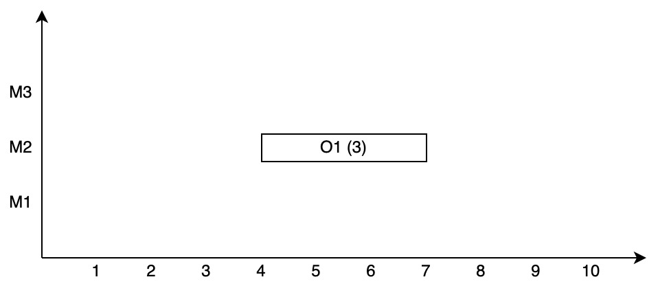
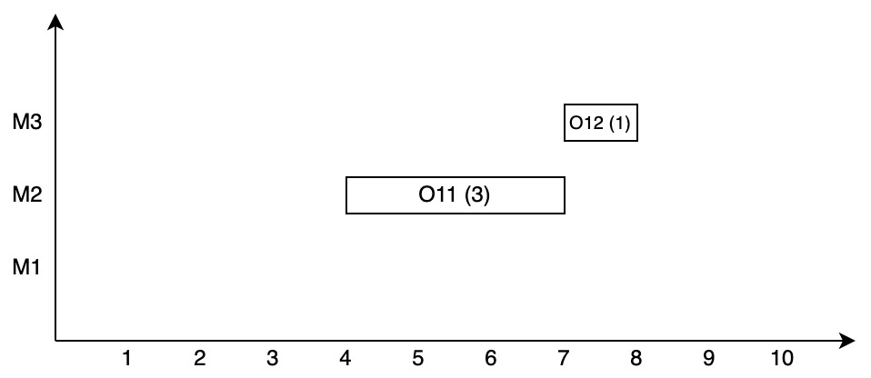
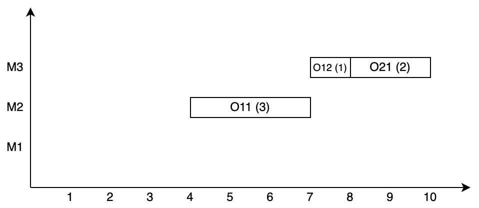
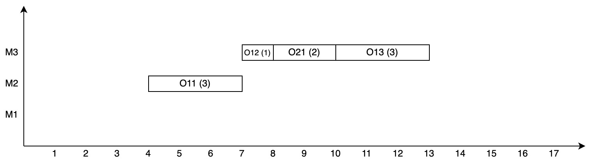
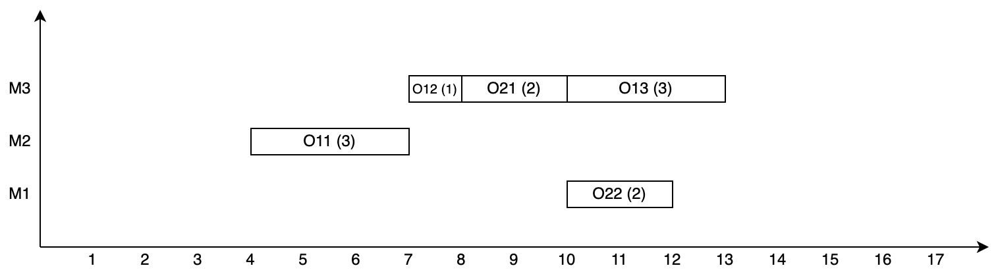
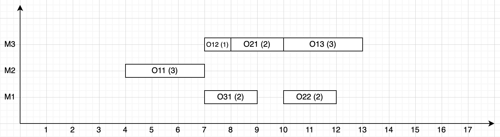
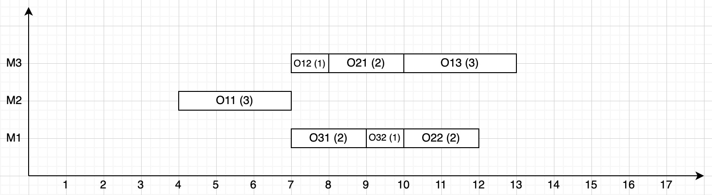
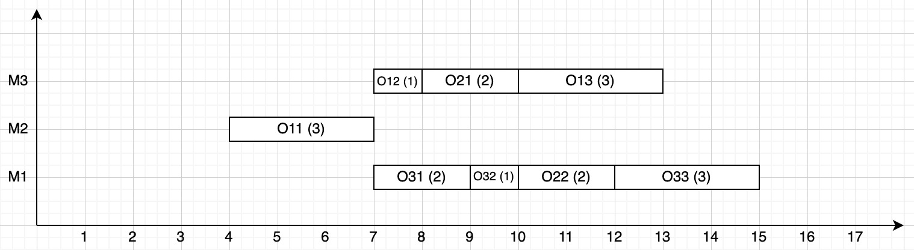

Given the following problem:

Job 1

| Operation / Machine | M1 | M2 | M3 |
|-------|------|-----|-----|
| 1 | 1 | 3 | 2 |
| 2 | ❌ | 2 | 1 |
| 3 | ❌ | ❌ | 3 |

 

Job 2

| Operation / Machine | M1 | M2 | M3 |
|-------|------|-----|-----|
| 1 | ❌ | ❌ | 2 |
| 2 | 2 | 2 | 1 |

 

Job 3

| Operation / Machine | M1 | M2 | M3 |
|-------|------|-----|-----|
| 1 | 2 | 1 | ❌ |
| 2 | 1 | ❌ | 1 |
| 3 | 3 | ❌ | ❌ |

Release times:

| Time | Job 1 | Job 2 | Job 3 |
|-----|------|------|------|
| | 4 | 6 | 7 |

Simulation

STEP 1:
OPERATION 1 | MACHINE 2

 

STEP 2:
OPERATION 2 | MACHINE 3

 

STEP 3:
OPERATION 4 | MACHINE 3

 

STEP 4:
OPERATION 3 | MACHINE 3

 

STEP 5:
OPERATION 5 | MACHINE 1

 

STEP 6:
OPERATION 6 | MACHINE 1

 

STEP 7:
OPERATION 7 | MACHINE 1

 

STEP 8:
OPERATION 8 | MACHINE 1

 

